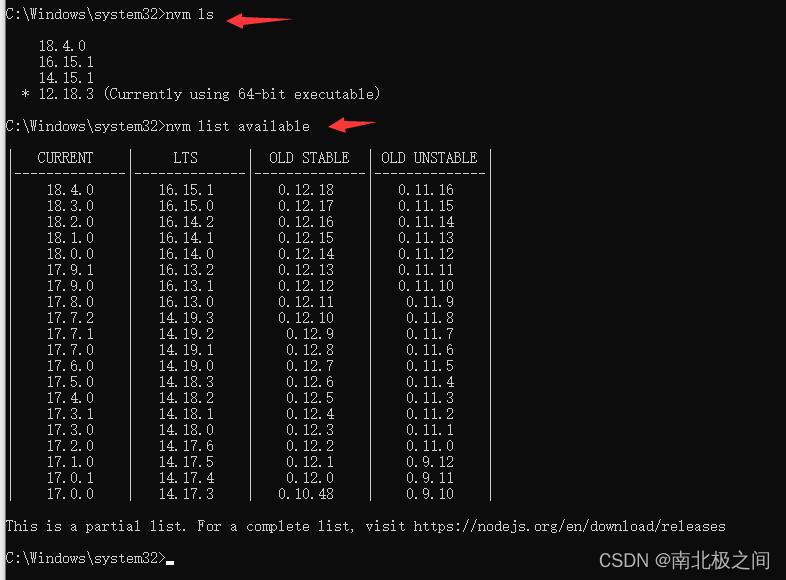
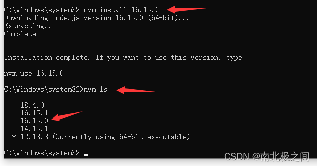
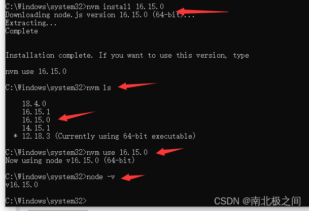

### nvm 介绍、nvm 下载、nvm 安装、配置及 nvm 使用

在工作中，我们可能同时在进行 2 个或者多个 **不同的** 项目开发，每个项目的需求不同，进而不同项目必须依赖不同版本的 NodeJS 运行环境，这种情况下，对于维护多个版本的 node 将会是一件非常麻烦的事情，nvm 就是为解决这个问题而产生的，他可以方便的在同一台设备上进行多个 node 版本之间切换。

## 1、nvm 介绍

Node Version Manager（NVM） 是一种用于管理多个主动节点.js 版本的工具。

Node.js 平台，Node.js 工具社区和 Node.js 库是快速移动的目标 - 在一个 Node.js 版本下可能有效的方法不能保证适用于另一个版本的 Node.js。因此，用户需要一些方法在 Node 的多个版本之间切换.js

## 为什么使用 NVM？

NVM 允许用户：

- 使用简单的命令在本地下载任何远程长期支持 （LTS） 版本的 Node.js。
- 直接从命令行在 Node.js 的多个版本之间轻松切换。
- 设置别名以轻松在不同下载版本的 Node.js 之间切换。

## 2、下载

### 操作系统支持

nvm 同时支持 Linux 和 macOS

我们这里是在 Windows 上操作

下载链接：https://github.com/coreybutler/nvm-windows/releases

## 3、安装：

如果电脑上之前已经单独安装了 node，先卸载（可以在控制面板里面卸载），然后再安装 nvm

傻瓜式一直点击下一步即可安装。

安装完成后，可以打开 cmd 命令行窗口。执行

> nvm -v

就可以看见 nvm 的版本号啦！

## 4、使用：

> nvm ls // 查显示可以安装的所有 node.js 的版本

> nvm list available // 查显示可以安装的所有 node.js 的版本

可以在可选列表里。选择任意版本安装，比如安装 16.15.0

执行：

> nvm install 16.15.0

安装好了之后。可以执行：

> nvm ls

可以在列表里看到这个版本：

如果想使用 16.15.0 这个版本的话。就执行：

> nvm use 16.15.0

然后执行：

> node -v

就可以看到当前版本已经是 16.15.0 了

